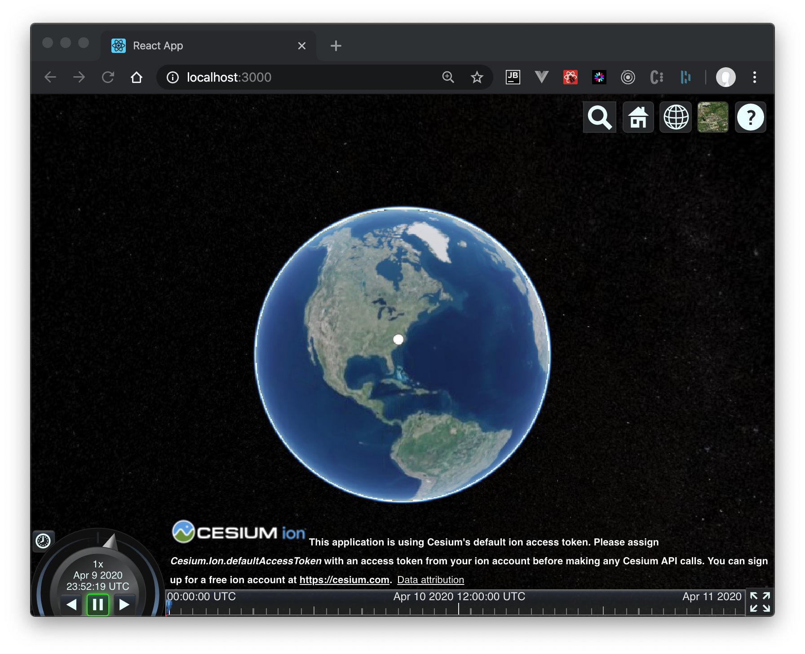
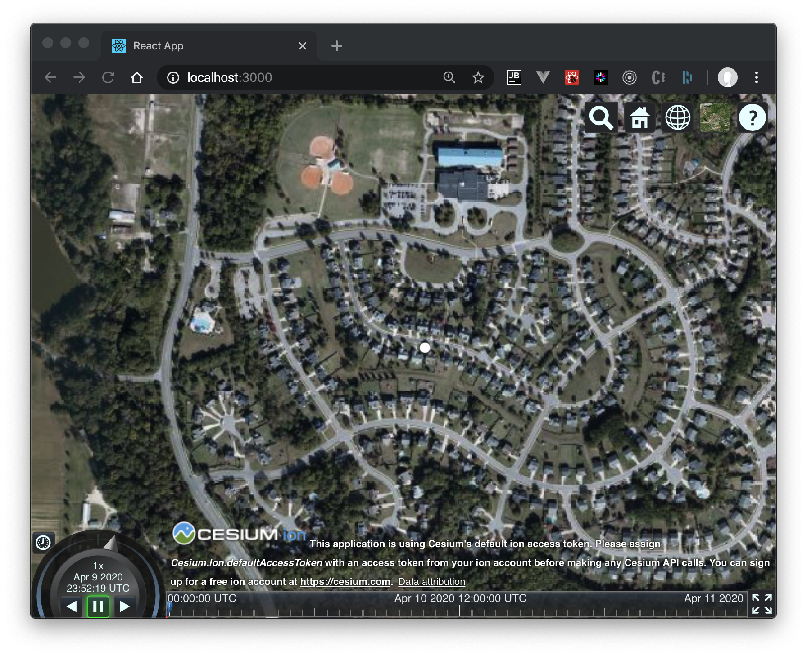

# Earth Rendered in Cesium/Resium

Resium is a React component wrapper for Cesium, a 3-D geo-spatial rendering library.

Resium Ref: [https://github.com/darwin-education/resium](https://github.com/darwin-education/resium)  

Cesium Ref: [https://cesium.com/index.html](https://cesium.com/index.html) 

Resium Testing Ref: [https://resium.darwineducation.com/contribution#adding-unit-tests-for-components](https://resium.darwineducation.com/contribution#adding-unit-tests-for-components) 

## Purpose of Project
The purpose of this project is to show how to have Resium or Cesium in a
unit test. We abandoned Jest for testing anything having Cesium in it. We investigated

`mocha`: reputed to not have issues with Cesium and 
`commonjs` require.

We ran this on the project after generation by react-cli:

`yarn add babel-register babel-core babel-loader babel-preset-es2015 babel-preset-react babel-preset-stage-0 --dev`

`yarn add mocha-jsdom --dev`

`yarn add chai --dev`

We added .babelrc to the project root, containing this:

```javascript
{
  "presets": ["react", "es2015", "stage-0"]
}
```

#### Run Earth2 Test

`mocha --require babel-register ./src/Earth.test.js`

If you configure the `karma` test runner to run `src/*.test.js`:

```javascript
karma start &
karma run karma run  --require babel-register
```

You can omit the `--require babel-register` option if you place a
`.mocharc.js` file in the root directory that has the require within it.
The purpose is to enable module imports to work in the test target.

```javascript
module.exports = {
    'require': 'babel-register'
};
```

#### References 
+ [https://www.pluralsight.com/guides/unit-test-react-component-mocha](https://www.pluralsight.com/guides/unit-test-react-component-mocha)
+ [https://cesium.com/blog/2019/10/31/cesiumjs-es6/](https://cesium.com/blog/2019/10/31/cesiumjs-es6/)

## Default View



## View of Address Search Result



---
## Running The Actual Application
This project was bootstrapped with [Create React App](https://github.com/facebook/create-react-app).

## Available Scripts

In the project directory, you can run:

### `yarn start`

Runs the app in the development mode.<br />
Open [http://localhost:3000](http://localhost:3000) to view it in the browser.

The page will reload if you make edits.<br />
You will also see any lint errors in the console.

### `yarn test`

Launches the test runner in the interactive watch mode.<br />
See the section about [running tests](https://facebook.github.io/create-react-app/docs/running-tests) for more information.

### `yarn build`

Builds the app for production to the `build` folder.<br />
It correctly bundles React in production mode and optimizes the build for the best performance.

The build is minified and the filenames include the hashes.<br />
Your app is ready to be deployed!

See the section about [deployment](https://facebook.github.io/create-react-app/docs/deployment) for more information.

### `yarn eject`

**Note: this is a one-way operation. Once you `eject`, you can’t go back!**

If you aren’t satisfied with the build tool and configuration choices, you can `eject` at any time. This command will remove the single build dependency from your project.

Instead, it will copy all the configuration files and the transitive dependencies (webpack, Babel, ESLint, etc) right into your project so you have full control over them. All of the commands except `eject` will still work, but they will point to the copied scripts so you can tweak them. At this point you’re on your own.

You don’t have to ever use `eject`. The curated feature set is suitable for small and middle deployments, and you shouldn’t feel obligated to use this feature. However we understand that this tool wouldn’t be useful if you couldn’t customize it when you are ready for it.

## Learn More

You can learn more in the [Create React App documentation](https://facebook.github.io/create-react-app/docs/getting-started).

To learn React, check out the [React documentation](https://reactjs.org/).

### Code Splitting

This section has moved here: https://facebook.github.io/create-react-app/docs/code-splitting

### Analyzing the Bundle Size

This section has moved here: https://facebook.github.io/create-react-app/docs/analyzing-the-bundle-size

### Making a Progressive Web App

This section has moved here: https://facebook.github.io/create-react-app/docs/making-a-progressive-web-app

### Advanced Configuration

This section has moved here: https://facebook.github.io/create-react-app/docs/advanced-configuration

### Deployment

This section has moved here: https://facebook.github.io/create-react-app/docs/deployment

### `yarn build` fails to minify

This section has moved here: https://facebook.github.io/create-react-app/docs/troubleshooting#npm-run-build-fails-to-minify
